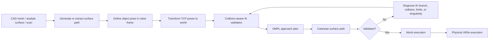
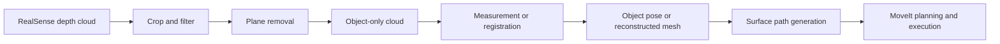
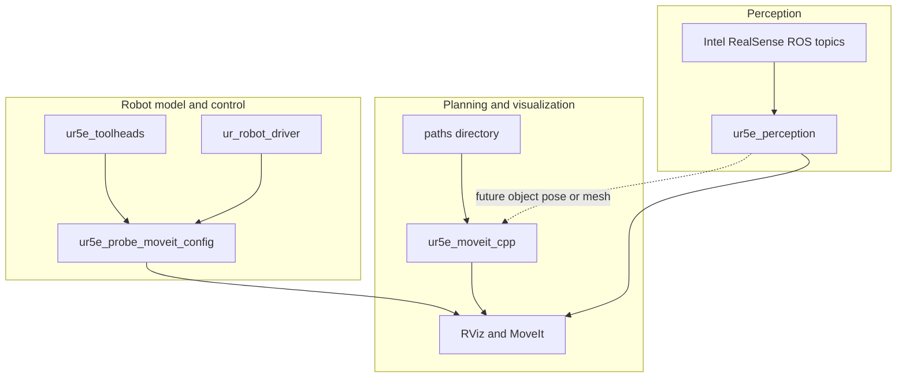
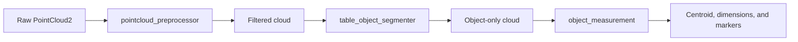
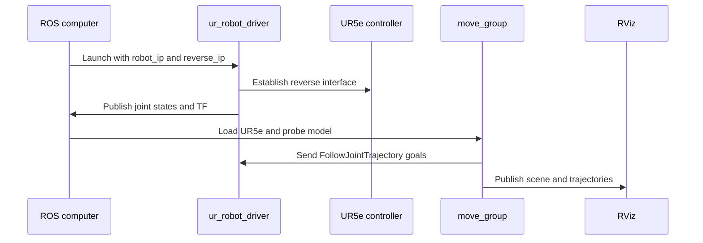
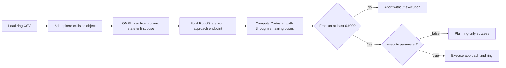
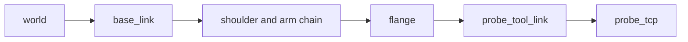
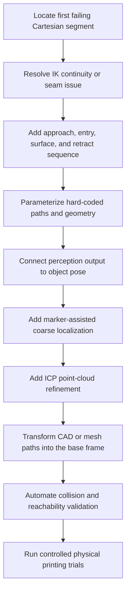

> **Syringe demo branch:** Start with [DEMO_RUNBOOK.md](docs/DEMO_RUNBOOK.md). It supersedes older syringe execution examples below and includes calibration, rehearsal, printing and stop/recovery commands.

# UR5e Surface Printing ROS 2

> ROS 2 Jazzy + MoveIt 2 research workspace for curved-surface path generation, UR5e planning, custom tool integration, RealSense point-cloud processing, RViz visualization, mock execution, and physical-robot bring-up.

[](https://docs.ros.org/en/jazzy/)
[](https://moveit.picknik.ai/)
[](https://ubuntu.com/)
[](#)
[](src/ur5e_perception/LICENSE)

> [!WARNING]
> Several early demonstration nodes execute motion immediately after planning. Use mock hardware and RViz first. Review every target, frame, collision object, tool transform, controller, and speed before using the physical UR5e.

---

## Contents

- [Project overview](#project-overview)
- [System architecture](#system-architecture)
- [Repository layout](#repository-layout)
- [Packages](#packages)
- [Installation](#installation)
- [Build](#build)
- [Mock RViz workflow](#mock-rviz-workflow)
- [Physical UR5e workflow](#physical-ur5e-workflow)
- [Surface-path workflows](#surface-path-workflows)
- [RealSense perception workflow](#realsense-perception-workflow)
- [Executable reference](#executable-reference)
- [Coordinate frames and conventions](#coordinate-frames-and-conventions)
- [Current status](#current-status)
- [Known limitations](#known-limitations)
- [Development roadmap](#development-roadmap)
- [License](#license)

---

## Project overview

This repository documents the development of a computation-focused robotic surface-printing pipeline. It progresses from basic MoveIt motion tests to custom end-effector modeling, collision-scene construction, trajectory analysis, curved-surface toolpath generation, point-cloud preprocessing, and real-robot launch integration.



Longer-term target:



---

## System architecture



The repository contains four ROS packages plus standalone generated path data:

| Component | Role |
|---|---|
| `ur5e_moveit_cpp` | Planning, trajectory analysis, collision objects, path visualization, and surface-following experiments |
| `ur5e_toolheads` | UR5e and custom probe/tool robot descriptions for mock and physical configurations |
| `ur5e_probe_moveit_config` | SRDF, kinematics, controllers, RViz, mock launch, and physical-robot MoveIt launch files |
| `ur5e_perception` | PCL-based RealSense point-cloud preprocessing, table removal, and object measurement |
| `paths/` | Hemisphere generator and generated CSV waypoint sets |

---

## Repository layout

```text
ur5e_surface_printing_ros2/
├── README.md
├── paths/
│   ├── generate_hemisphere_ring.py
│   ├── hemisphere_ring.csv
│   ├── hemisphere_ring_start_00.csv
│   ├── hemisphere_ring_start_01.csv
│   └── ...
└── src/
    ├── ur5e_moveit_cpp/
    │   ├── CMakeLists.txt
    │   ├── package.xml
    │   ├── data/
    │   │   └── toolpaths/
    │   ├── meshes/
    │   └── src/
    │       ├── simple_joint_motion.cpp
    │       ├── simple_pose_motion.cpp
    │       ├── plan_only_trajectory.cpp
    │       ├── save_trajectory_csv.cpp
    │       ├── analyze_trajectory.cpp
    │       ├── compare_pose_candidates.cpp
    │       ├── add_box_only.cpp
    │       ├── collision_object_demo.cpp
    │       ├── collision_aware_candidate_planner.cpp
    │       ├── remove_all_objects.cpp
    │       ├── parameterized_shape_adder.cpp
    │       ├── hemisphere_surface_demo.cpp
    │       └── visualize_surface_toolpath.cpp
    ├── ur5e_toolheads/
    │   ├── launch/
    │   ├── meshes/
    │   └── urdf/
    ├── ur5e_probe_moveit_config/
    │   ├── config/
    │   └── launch/
    └── ur5e_perception/
        ├── CMakeLists.txt
        ├── package.xml
        ├── LICENSE
        └── src/
            ├── pointcloud_preprocessor.cpp
            ├── table_object_segmenter.cpp
            └── object_measurement.cpp
```

> [!NOTE]
> This repository is organized as a ROS workspace snapshot. ROS packages are stored under `src/`, while generated path data is stored in the top-level `paths/` directory.

---

## Packages

### `ur5e_moveit_cpp`

Core C++ package for MoveIt experimentation.

It includes:

- joint-space and pose-space motion examples;
- plan-only trajectory inspection;
- CSV trajectory export;
- trajectory quality metrics;
- candidate-pose comparison;
- collision-object insertion and cleanup;
- parameterized box, cylinder, and sphere insertion;
- raster toolpath and mesh visualization;
- collision-aware hemisphere approach and Cartesian path planning.

The package installs its `data/` and `meshes/` directories into the package share directory. This allows RViz nodes to use package resources such as:

```text
package://ur5e_moveit_cpp/meshes/apple_surface_z_up.stl
```

### `ur5e_toolheads`

Robot-description package for the custom tool.

Important frame chain:

```text
world
└── base_link
    └── UR5e arm links
        └── flange
            └── probe_tool_link
                └── probe_tcp
```

The tool is attached to the UR5e `flange`. The final planning TCP for the surface-following work is:

```text
probe_tcp
```

The package contains:

- reusable probe-tool xacro definitions;
- custom tool visual and collision geometry;
- mock UR5e robot descriptions;
- physical UR5e robot descriptions using `ur_robot_driver`;
- robot-state-publisher launch integration for the physical robot.

### `ur5e_probe_moveit_config`

MoveIt configuration adapted for the probe-equipped UR5e.

| Setting | Value |
|---|---|
| Planning group | `ur_manipulator` |
| Kinematic chain | `base_link` to `probe_tcp` |
| Planning frame | `world` |
| Virtual joint | Fixed `world` to `base_link` |
| IK solver | KDL |
| IK timeout | `0.05 s` |
| IK attempts | `10` |
| Default velocity scaling | `0.1` |
| Default acceleration scaling | `0.1` |
| Mock controller | `ur_manipulator_controller` |
| Physical controller | `scaled_joint_trajectory_controller` |

Mock launch:

```bash
ros2 launch ur5e_probe_moveit_config demo.launch.py
```

Physical launch:

```bash
ros2 launch ur5e_probe_moveit_config real_robot.launch.py \
  robot_ip:=192.168.1.102 \
  reverse_ip:=192.168.1.100 \
  launch_rviz:=true
```

### `ur5e_perception`

PCL-based RealSense processing package.



Executables:

- `pointcloud_preprocessor`
- `table_object_segmenter`
- `object_measurement`

Main dependencies:

- `rclcpp`
- `sensor_msgs`
- `geometry_msgs`
- `visualization_msgs`
- `pcl_conversions`
- `pcl_ros`
- PCL filters, search, and segmentation components

---

## Installation

### Base environment

The project has been developed using:

```text
Ubuntu 24.04
ROS 2 Jazzy
MoveIt 2
Universal Robots ROS 2 driver
Intel RealSense ROS wrapper
PCL
```

Install the main binary dependencies:

```bash
sudo apt update

sudo apt install \
  ros-jazzy-moveit \
  ros-jazzy-ur \
  ros-jazzy-ur-robot-driver \
  ros-jazzy-realsense2-camera \
  ros-jazzy-pcl-ros \
  ros-jazzy-pcl-conversions
```

### Clone into a workspace

Because the repository already contains a `src/` directory, it can be cloned directly as the workspace:

```bash
cd ~

git clone \
  https://github.com/SafwanKamal/ur5e_surface_printing_ros2.git \
  ur5e_ws

cd ~/ur5e_ws
```

Expected result:

```text
~/ur5e_ws/
├── paths/
├── src/
└── README.md
```

Install unresolved ROS dependencies:

```bash
cd ~/ur5e_ws
source /opt/ros/jazzy/setup.bash

rosdep install \
  --from-paths src \
  --ignore-src \
  -r \
  -y
```

---

## Build

Build all repository packages:

```bash
cd ~/ur5e_ws
source /opt/ros/jazzy/setup.bash

colcon build \
  --symlink-install \
  --packages-select \
    ur5e_toolheads \
    ur5e_probe_moveit_config \
    ur5e_moveit_cpp \
    ur5e_perception

source install/setup.bash
```

Build only the planning package:

```bash
cd ~/ur5e_ws
source /opt/ros/jazzy/setup.bash

colcon build \
  --symlink-install \
  --packages-select ur5e_moveit_cpp

source install/setup.bash
```

Clean rebuild:

```bash
cd ~/ur5e_ws

rm -rf \
  build/ur5e_toolheads \
  install/ur5e_toolheads \
  build/ur5e_probe_moveit_config \
  install/ur5e_probe_moveit_config \
  build/ur5e_moveit_cpp \
  install/ur5e_moveit_cpp \
  build/ur5e_perception \
  install/ur5e_perception

source /opt/ros/jazzy/setup.bash
colcon build --symlink-install
source install/setup.bash
```

Source the workspace in every new terminal:

```bash
source /opt/ros/jazzy/setup.bash
source ~/ur5e_ws/install/setup.bash
```

---

## Mock RViz workflow

### Terminal 1 — launch robot, MoveIt, controllers, and RViz

```bash
source /opt/ros/jazzy/setup.bash
source ~/ur5e_ws/install/setup.bash

ros2 launch ur5e_probe_moveit_config demo.launch.py
```

This launch should provide:

- the UR5e robot model;
- the custom probe tool;
- `probe_tcp`;
- `move_group`;
- mock ros2_control hardware;
- the joint trajectory controller;
- the joint-state broadcaster;
- RViz with the MoveIt MotionPlanning panel.

### Terminal 2 — verify the environment

```bash
source /opt/ros/jazzy/setup.bash
source ~/ur5e_ws/install/setup.bash

ros2 node list
ros2 control list_controllers
ros2 topic echo /joint_states --once
ros2 run tf2_ros tf2_echo world probe_tcp
```

Expected planning configuration:

```text
planning group: ur_manipulator
planning frame: world
end-effector link: probe_tcp
```

> [!TIP]
> The older learning nodes use `tool0`. The curved-surface planner uses `probe_tcp`. Their target poses are not interchangeable without accounting for the fixed tool transform.

---

## Physical UR5e workflow

The physical launch combines:

- `ur_robot_driver`;
- the custom UR5e and probe-tool description;
- joint-state and TF publication;
- MoveIt `move_group`;
- the physical MoveIt controller configuration;
- optional RViz.



Launch:

```bash
source /opt/ros/jazzy/setup.bash
source ~/ur5e_ws/install/setup.bash

ros2 launch ur5e_probe_moveit_config real_robot.launch.py \
  robot_ip:=192.168.1.102 \
  reverse_ip:=192.168.1.100 \
  launch_rviz:=true
```

The physical MoveIt configuration sends trajectory goals through:

```text
scaled_joint_trajectory_controller
```

Expected action:

```text
/scaled_joint_trajectory_controller/follow_joint_trajectory
```

> [!CAUTION]
> Before physical execution, confirm the robot and ROS computer IP addresses, External Control URCap setup, active controller state, tool transform, physical TCP, collision model, safety planes, reduced mode, and emergency-stop access.

---

## Surface-path workflows

### Analytic hemisphere path

The hemisphere test uses a known analytic sphere. This isolates path orientation, IK, collision checking, and Cartesian continuity from mesh-processing uncertainty.

Generate the paths:

```bash
cd ~/ur5e_ws
python3 paths/generate_hemisphere_ring.py
```

Current generator constants:

```text
Sphere center:       (0.55, 0.00, 0.25) m
Sphere radius:       0.075 m
Sphere diameter:     0.150 m
TCP standoff:        0.015 m
Latitude PHI:        70.4 degrees
Segments per ring:   72
Generated starts:    10
```

Generated files:

```text
paths/hemisphere_ring_start_00.csv
paths/hemisphere_ring_start_01.csv
...
paths/hemisphere_ring_start_09.csv
```

CSV schema:

```text
x,y,z,qx,qy,qz,qw,nx,ny,nz
```

| Columns | Meaning |
|---|---|
| `x,y,z` | TCP position in the MoveIt `world` frame |
| `qx,qy,qz,qw` | TCP orientation quaternion |
| `nx,ny,nz` | Outward sphere normal |

Orientation convention:

```text
Local +Z: points inward toward the sphere center
Local +X: follows the ring tangent
Local +Y: completes the right-handed frame
```

Plan the approach and ring:

```bash
ros2 run ur5e_moveit_cpp hemisphere_surface_demo \
  --ros-args \
  -p csv_path:=/home/desktop/ur5e_ws/paths/hemisphere_ring_start_00.csv \
  -p execute:=false \
  -p eef_step:=0.002 \
  -p jump_threshold:=0.0
```

Internal workflow:



Default parameters:

```text
csv_path:
  /home/desktop/ur5e_ws/paths/hemisphere_ring_start_00.csv

execute:
  false

eef_step:
  0.002 m

jump_threshold:
  0.0
```

> [!IMPORTANT]
> Execution is disabled by default. Keep `execute:=false` until the full Cartesian path is validated.

Current validated checkpoint:

```text
12/12 tested tool-roll variants:
  collision-free IK succeeded

10/10 sampled ring starts:
  collision-aware IK and valid target state succeeded

OMPL approach to Start 00:
  succeeded

Full Cartesian ring:
  approximately 0.859 completion
```

### Mesh and raster visualization

The raster visualizer displays an object mesh and a generated surface toolpath without planning or execution.

Default resources:

```text
CSV:
  data/toolpaths/front_raster.csv

Mesh:
  meshes/apple_surface_z_up.stl

Mesh resource:
  package://ur5e_moveit_cpp/meshes/apple_surface_z_up.stl
```

Default object pose:

```text
Position:
  x = 0.60
  y = 0.00
  z = 0.10

Orientation:
  roll  = 0 degrees
  pitch = 0 degrees
  yaw   = 90 degrees

Mesh scale:
  0.001
```

Run:

```bash
ros2 run ur5e_moveit_cpp visualize_surface_toolpath
```

Published topics:

```text
/surface_toolpath/markers
/surface_toolpath/poses
```

Expected raster CSV fields:

```text
line_id
point_index
tcp_x_mm
tcp_y_mm
tcp_z_mm
qx
qy
qz
qw
```

The visualizer:

1. loads object-relative TCP poses;
2. converts millimeter coordinates to meters;
3. constructs the object pose in `world`;
4. applies the object-to-world transform;
5. publishes the object mesh;
6. publishes each raster line as a line strip;
7. publishes sampled tool `+Z` arrows;
8. publishes all transformed poses as a `PoseArray`.

Transform used:

```text
T_world_tool = T_world_object × T_object_tool
```

Add these displays in RViz:

```text
MarkerArray:
  /surface_toolpath/markers

PoseArray:
  /surface_toolpath/poses
```

> [!IMPORTANT]
> The mesh published by this node is an RViz visualization marker. It is not automatically added to the MoveIt planning scene as a collision object.

---

## RealSense perception workflow

The perception package separates preprocessing, table removal, and object measurement into independent nodes.

```text
Raw aligned depth point cloud
→ workspace crop
→ invalid-point removal
→ downsampling and noise reduction
→ dominant table-plane segmentation
→ object-only cloud
→ centroid and bounding-box measurement
→ later registration or mesh reconstruction
```

### Start the RealSense camera

```bash
source /opt/ros/jazzy/setup.bash
source ~/ur5e_ws/install/setup.bash

ros2 launch realsense2_camera rs_launch.py \
  pointcloud.enable:=true \
  align_depth.enable:=true
```

### Run preprocessing

```bash
ros2 run ur5e_perception pointcloud_preprocessor
```

Purpose:

- subscribe to a `PointCloud2` input;
- remove irrelevant workspace regions;
- filter invalid or noisy points;
- produce a smaller cloud for later processing.

### Run table and object segmentation

```bash
ros2 run ur5e_perception table_object_segmenter
```

Purpose:

- identify the dominant planar surface using PCL segmentation;
- remove or separate the table plane;
- publish the remaining object cloud.

### Run object measurement

```bash
ros2 run ur5e_perception object_measurement
```

Purpose:

- compute minimum and maximum 3D bounds;
- compute the centroid;
- estimate object dimensions;
- publish pose and visualization markers.

> [!NOTE]
> Topic names, crop limits, and numerical thresholds currently live in the C++ source files. Check those values before using a different camera namespace, mounting pose, or workspace layout.

---

## Executable reference

### `ur5e_moveit_cpp`

| Executable | Main behavior | Executes motion? |
|---|---|---:|
| `simple_joint_motion` | Reads current joints, adds `0.8 rad` to joint 0, plans, and runs | Yes |
| `simple_pose_motion` | Moves `tool0` by `+0.02 m` in X using approximate IK | Yes |
| `plan_only_trajectory` | Plans joint 0 `+0.2 rad` and prints every trajectory point | No |
| `save_trajectory_csv` | Plans joint 0 `+0.2 rad` and exports positions and velocities | No |
| `analyze_trajectory` | Computes duration, path length, joint movement, velocities, and step changes | No |
| `compare_pose_candidates` | Tests offsets around `tool0` and executes the shortest successful plan | Yes |
| `add_box_only` | Adds a visible box and republishes the planning-scene diff | No |
| `collision_object_demo` | Adds a box, plans around it, and executes a joint-space motion | Yes |
| `collision_aware_candidate_planner` | Adds a box, tests pose candidates, and executes the shortest collision-free plan | Yes |
| `remove_all_objects` | Removes known planning-scene objects and clears RViz geometry | No |
| `parameterized_shape_adder` | Adds a parameterized box, cylinder, or sphere | No |
| `hemisphere_surface_demo` | Plans an OMPL approach and Cartesian sphere ring using `probe_tcp` | Optional |
| `visualize_surface_toolpath` | Publishes a mesh, raster lines, poses, and orientation arrows | No |

### `simple_joint_motion`

```text
current joint state
→ joint 0 + 0.8 rad
→ plan
→ execute
```

Velocity and acceleration scaling:

```text
0.1
```

Run:

```bash
ros2 run ur5e_moveit_cpp simple_joint_motion
```

> [!WARNING]
> This node executes the trajectory automatically after successful planning.

### `simple_pose_motion`

```text
current tool0 pose
→ target X + 0.02 m
→ approximate IK target
→ plan
→ execute
```

Run:

```bash
ros2 run ur5e_moveit_cpp simple_pose_motion
```

> [!WARNING]
> This node executes automatically and uses `tool0`, not `probe_tcp`.

### `plan_only_trajectory`

Target:

```text
joint 0 + 0.2 rad
```

Outputs:

- joint names;
- trajectory point count;
- time from start;
- positions;
- velocities.

Run:

```bash
ros2 run ur5e_moveit_cpp plan_only_trajectory
```

### `save_trajectory_csv`

Current output path:

```text
/home/safwan/ur5e_planned_trajectory.csv
```

CSV fields include:

- point index;
- time from start;
- joint positions;
- joint velocities.

Run:

```bash
ros2 run ur5e_moveit_cpp save_trajectory_csv
```

> [!NOTE]
> The output path is currently hard-coded and should later become a ROS parameter.

### `analyze_trajectory`

Reports:

- total trajectory duration;
- total joint-space distance;
- average joint-space speed;
- total absolute movement for each joint;
- maximum absolute velocity for each joint;
- maximum single-step joint change.

Run:

```bash
ros2 run ur5e_moveit_cpp analyze_trajectory
```

### `compare_pose_candidates`

Tests:

```text
+X 10 cm
-X 10 cm
+Y 10 cm
-Y 10 cm
+Z 8 cm
-Z 8 cm
```

The shortest successful joint-space plan is executed.

```bash
ros2 run ur5e_moveit_cpp compare_pose_candidates
```

> [!WARNING]
> This node executes the selected plan.

### `add_box_only`

Actual primitive dimensions:

```text
0.20 × 0.20 × 0.20 m
```

Pose:

```text
x = 0.80
y = 0.20
z = 0.40
```

Run:

```bash
ros2 run ur5e_moveit_cpp add_box_only
```

### `collision_object_demo`

Box:

```text
Size:
  0.60 × 0.60 × 0.60 m

Position:
  x = 0.70
  y = 0.00
  z = 0.30
```

Motion:

```text
joint 0 + 0.4 rad
joint 1 + 0.2 rad
```

Run:

```bash
ros2 run ur5e_moveit_cpp collision_object_demo
```

> [!WARNING]
> This node executes the planned trajectory.

### `collision_aware_candidate_planner`

Box:

```text
Size:
  0.30 × 0.30 × 0.30 m

Position:
  x = 0.80
  y = 0.00
  z = 0.30
```

Candidates:

```text
+X 12 cm
-X 12 cm
+Y 12 cm
-Y 12 cm
+Z 10 cm
-Z 10 cm
```

Selection metric:

```text
smallest total joint-space distance
```

Run:

```bash
ros2 run ur5e_moveit_cpp collision_aware_candidate_planner
```

> [!WARNING]
> This node executes the selected collision-aware plan.

### `remove_all_objects`

Removes every collision object known to MoveIt and publishes explicit `REMOVE` operations to:

```text
/monitored_planning_scene
```

Run:

```bash
ros2 run ur5e_moveit_cpp remove_all_objects
```

### `parameterized_shape_adder`

Supported shapes:

```text
box
cylinder
sphere
```

Supported parameters:

```text
shape_type
object_id
frame_id
center_x
center_y
center_z
box_x
box_y
box_z
radius
height
```

Sphere example:

```bash
ros2 run ur5e_moveit_cpp parameterized_shape_adder \
  --ros-args \
  -p shape_type:=sphere \
  -p object_id:=test_sphere \
  -p frame_id:=world \
  -p center_x:=0.55 \
  -p center_y:=0.00 \
  -p center_z:=0.25 \
  -p radius:=0.075
```

Cylinder example:

```bash
ros2 run ur5e_moveit_cpp parameterized_shape_adder \
  --ros-args \
  -p shape_type:=cylinder \
  -p object_id:=test_cylinder \
  -p frame_id:=world \
  -p center_x:=0.60 \
  -p center_y:=0.00 \
  -p center_z:=0.25 \
  -p radius:=0.10 \
  -p height:=0.30
```

Box example:

```bash
ros2 run ur5e_moveit_cpp parameterized_shape_adder \
  --ros-args \
  -p shape_type:=box \
  -p object_id:=test_box \
  -p frame_id:=world \
  -p center_x:=0.60 \
  -p center_y:=0.00 \
  -p center_z:=0.20 \
  -p box_x:=0.20 \
  -p box_y:=0.20 \
  -p box_z:=0.20
```

This node does not plan or execute motion.

### `hemisphere_surface_demo`

The node:

1. loads a ring CSV;
2. adds the spherical workpiece as a MoveIt collision object;
3. plans a collision-aware OMPL approach to the first waypoint;
4. uses `probe_tcp` as the end-effector link;
5. builds a `RobotState` from the final point of the approach;
6. excludes the first CSV pose from the Cartesian waypoint list;
7. computes a collision-aware Cartesian path;
8. reports the completion fraction;
9. executes only when explicitly requested.

Planning-only run:

```bash
ros2 run ur5e_moveit_cpp hemisphere_surface_demo
```

Explicit run:

```bash
ros2 run ur5e_moveit_cpp hemisphere_surface_demo \
  --ros-args \
  -p csv_path:=/home/desktop/ur5e_ws/paths/hemisphere_ring_start_00.csv \
  -p execute:=false \
  -p eef_step:=0.002 \
  -p jump_threshold:=0.0
```

Optional execution:

```bash
ros2 run ur5e_moveit_cpp hemisphere_surface_demo \
  --ros-args \
  -p execute:=true
```

> [!CAUTION]
> Do not enable execution until the full Cartesian path succeeds and the trajectory has been visually inspected.

### `visualize_surface_toolpath`

Publishes:

```text
/surface_toolpath/markers
/surface_toolpath/poses
```

It does not:

- add the mesh as a collision object;
- run inverse kinematics;
- plan motion;
- execute motion.

Run:

```bash
ros2 run ur5e_moveit_cpp visualize_surface_toolpath
```

Example with an explicit object pose:

```bash
ros2 run ur5e_moveit_cpp visualize_surface_toolpath \
  --ros-args \
  -p object_x:=0.60 \
  -p object_y:=0.00 \
  -p object_z:=0.18 \
  -p object_roll_deg:=0.0 \
  -p object_pitch_deg:=0.0 \
  -p object_yaw_deg:=90.0 \
  -p mesh_scale:=0.001
```

### `ur5e_perception` executables

| Executable | Purpose |
|---|---|
| `pointcloud_preprocessor` | Filters and crops incoming point clouds before segmentation |
| `table_object_segmenter` | Uses PCL plane segmentation to remove the table and isolate the object |
| `object_measurement` | Computes centroid and bounds and publishes measurement visualization |

---

## Coordinate frames and conventions

### Robot frames



### Tool convention

```text
probe_tcp local +Z points from the TCP toward the surface.
```

This convention was confirmed after debugging an earlier local-Y flip that reversed the tool axis and caused collision-aware IK failures.

### Hemisphere normals

The generator stores the outward object normal:

```text
sphere center → surface point
```

The desired tool axis is its negative:

```text
TCP → sphere center
```

### Raster transformation

```text
T_world_tool = T_world_object × T_object_tool
```

### Future camera-based localization

For an eye-in-hand camera:

```text
T_base_object = T_base_camera × T_camera_object
```

Proposed hybrid localization:

```text
AprilTag or fixture pose
→ coarse object pose
→ predicted point-cloud crop
→ ICP refinement
→ final object-to-base transform
→ transform generated path
→ rerun collision and reachability validation
```

---

## Current status

### Working

- UR5e mock robot model with the custom probe tool;
- `probe_tcp` included in the MoveIt planning chain;
- KDL IK configuration;
- RViz and mock ros2_control launch;
- physical UR5e description and driver launch integration;
- primitive collision-object insertion and cleanup;
- trajectory generation, export, comparison, and analysis;
- raster mesh and path visualization;
- analytic hemisphere path generation;
- collision-aware sampled IK validation;
- OMPL approach planning to the first hemisphere waypoint;
- partial Cartesian ring planning;
- RealSense and PCL preprocessing, segmentation, and measurement package.

### Current Cartesian checkpoint

```text
Collision-aware sampled starts:
  10/10 valid

OMPL approach:
  successful

Cartesian completion:
  approximately 0.859

Cartesian trajectory points:
  257
```

The sampled waypoints are individually reachable, but the full ring does not yet maintain one continuous collision-free IK branch.

### Next diagnostic

```text
waypoint 00 → waypoint 01
waypoint 01 → waypoint 02
waypoint 02 → waypoint 03
...
```

Each segment should begin from the previous segment's final joint state.

The first failing segment should then be checked for:

- collision;
- wrist wrapping;
- joint limits;
- singularity;
- IK branch switching;
- abrupt joint-space movement;
- closed-loop seam discontinuity.

---

## Known limitations

- Several learning nodes execute by default.
- Older motion examples use `tool0`; surface planning uses `probe_tcp`.
- `save_trajectory_csv` contains a hard-coded `/home/safwan/...` output path.
- `hemisphere_surface_demo` contains a hard-coded `/home/desktop/...` CSV path.
- The Cartesian planner uses the older `jump_threshold` overload of `computeCartesianPath()`.
- Some comments in early collision-box examples do not match the actual dimensions in code.
- The raster mesh marker is not automatically a MoveIt collision object.
- The physical launch must be checked against the exact installed `ur_robot_driver` version.
- Perception topic names and thresholds are not yet consolidated into launch or YAML files.
- Hand-eye calibration has not yet been integrated.
- AprilTag or ArUco localization has not yet been integrated.
- Point-cloud registration and ICP refinement are future work.
- Automatic conversion from a localized scan to a transformed executable path is future work.
- Several package metadata files still contain placeholder descriptions, maintainers, or licenses.

---

## Useful diagnostics

Check the custom TCP:

```bash
ros2 run tf2_ros tf2_echo world probe_tcp
```

Check MoveIt:

```bash
ros2 node list | grep move_group
```

Check controllers:

```bash
ros2 control list_controllers
```

Check the current joint state:

```bash
ros2 topic echo /joint_states --once
```

Check package executables:

```bash
ros2 pkg executables ur5e_moveit_cpp
ros2 pkg executables ur5e_perception
```

Check the robot description:

```bash
ros2 param get /move_group robot_description
```

Remove stale collision objects:

```bash
ros2 run ur5e_moveit_cpp remove_all_objects
```

List surface visualization topics:

```bash
ros2 topic list | grep surface_toolpath
```

---

## Development roadmap



Planned high-level workflow:

```text
camera or scanner
→ object localization
→ reference mesh alignment
→ surface-path transformation
→ collision-aware validation
→ approach
→ entry
→ surface-following motion
→ retract
→ execution report
```

---

## License

The `ur5e_perception` package includes an Apache 2.0 license.

Other packages currently contain placeholder license metadata and should be normalized before formal distribution or external reuse.
